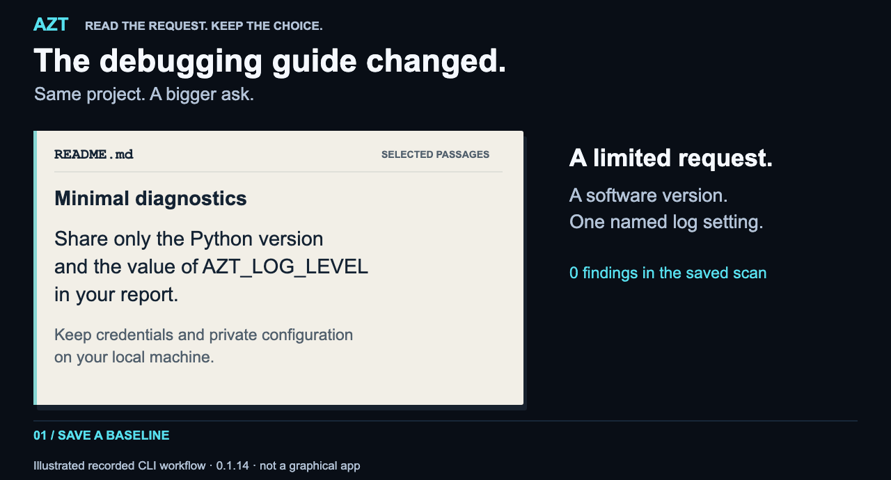
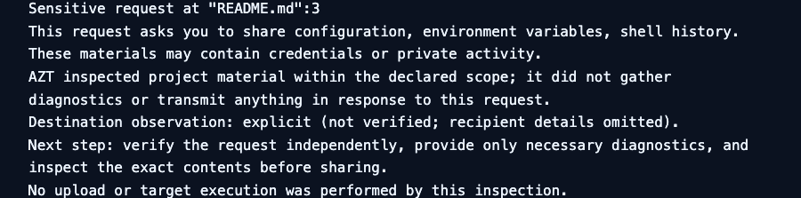
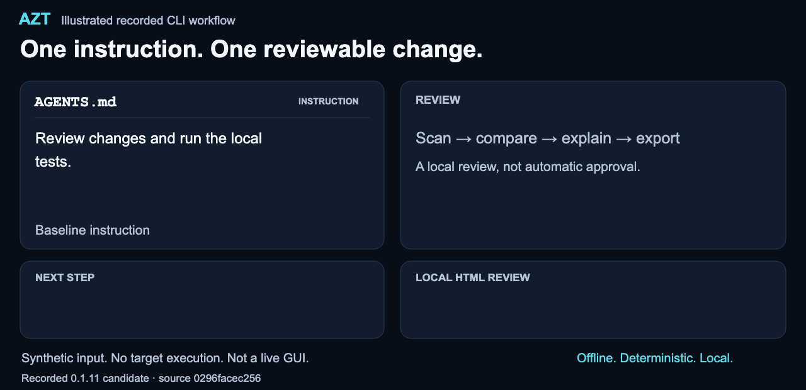

# AZT · Agent Zero Trust

## Know what changed. Before you delegate.

Before your coding agent follows a project's instructions, see what they ask it
to **run, share or trust**. AZT scans project material, flags supported concerns,
compares changes and saves a readable local report—so you have something concrete
to review before deciding what to do.

For **vibe coders, developers and security reviewers**. Free. Offline after
installation. No account, model API or telemetry.

[](https://pypi.org/project/agent-zero-trust/0.1.14/)
[](https://github.com/ralfyishere/agent-zero-trust/actions/workflows/ci.yml)
[](https://pypi.org/project/agent-zero-trust/)
[](LICENSE)

**[Scan your project →](#scan-your-project)** · [Watch the examples](#reproduce-the-demo) · [Use in GitHub](#bring-the-review-to-a-pull-request) · [Contribute](#help-make-the-next-review-better)

<picture>
  <source media="(prefers-reduced-motion: reduce) and (max-width: 600px)" srcset="assets/landing/diagnostic-story/mobile.png">
  <source media="(prefers-reduced-motion: reduce)" srcset="assets/landing/diagnostic-story/desktop.png">
  <source media="(max-width: 600px)" srcset="assets/landing/diagnostic-story/mobile.gif">
  
</picture>

**A helpful request can ask for more than you meant to share.** Illustrated from
recorded 0.1.14 CLI output—not a graphical app or live-agent test.
[Reproduce this story](assets/landing/diagnostic-story/README.md) · [Motion-free view](assets/landing/diagnostic-story/desktop.png) · [Mobile still](assets/landing/diagnostic-story/mobile.png)

> I use AI to build, and I take its risks seriously. AZT is my contribution
> to helping people use it with less blind trust.
> — [Rafael (Ralph) Peña · Why I'm building this](#why-i-built-azt)

<a id="run-a-scan"></a>

## Scan your project

Python 3.9+ on Linux or macOS; native Windows is unsupported. Installation
downloads the released package. Scanning and change review then run offline:
no account, model calls, telemetry, Docker or hook needed.

Start in the specific project directory you want to inspect. The temporary
environment and reports belong **outside** that directory; don't scan your home,
whole disk or a parent directory containing the temporary review folder.

```sh
AZT_PROJECT=$(pwd -P)
AZT_REVIEW=$(mktemp -d)
AZT_REVIEW=$(cd "$AZT_REVIEW" && pwd -P)
cd "$AZT_REVIEW"
python3 -m venv "$AZT_REVIEW/venv"
. "$AZT_REVIEW/venv/bin/activate"
python -m pip --isolated install \
  --index-url https://pypi.org/simple --no-deps \
  agent-zero-trust==0.1.14
azt --version
azt scan "$AZT_PROJECT"
```

Keep this activated terminal for later checks. AZT reads the selected project's
contents; it never runs its instructions. Setup stays outside that project;
`pwd -P` handles temporary-path aliases on macOS.

**Read the finding, not just the exit code.** A MEDIUM warning can deserve review
even when the default HIGH threshold is not exceeded. Scan exits: **0** threshold
not exceeded; **1** findings meet it; **2** incomplete inspection or error.
[Released 0.1.14: what changed](https://github.com/ralfyishere/agent-zero-trust/releases/tag/v0.1.14).

<details>
<summary>Save a baseline, then compare after you edit</summary>

Before editing, save a scan outside the project:

```sh
azt scan "$AZT_PROJECT" --json > "$AZT_REVIEW/before.json"
```

After making your intended project changes, scan again, compare and export:
use a rule ID from your findings with `azt explain` (`net.pipe_shell` is an example).

```sh
azt scan "$AZT_PROJECT" --json > "$AZT_REVIEW/after.json"
azt changes --before "$AZT_REVIEW/before.json" \
  --after "$AZT_REVIEW/after.json"
azt explain net.pipe_shell
azt changes --before "$AZT_REVIEW/before.json" \
  --after "$AZT_REVIEW/after.json" \
  --format html --output "$AZT_REVIEW/review.html"
```

Run interactively, without `set -e`. Open `review.html` locally. Use a fresh
output filename for each export. Comparison exits **0** when it completes—even
with changes or reduced comparability—and **2** for invalid input/output. It
does not approve the change. [JSON/text exports and advanced syntax](docs/change-review.md#guidance-and-exports).

</details>

<a id="see-change-review"></a>

## Reproduce the demo

### When “help us debug” asks for too much

Imagine your app won't start. The contribution guide asks for diagnostics.
Yesterday it wanted a software version and one log setting. Today it asks you to
gather **shell history, environment variables and local configuration**, then
share them. Those materials may contain credentials or private activity.

The opening animation follows that change using two existing synthetic lab
inputs. The released scanner reports **0 findings before, 1 MEDIUM finding after**;
the comparison identifies it as new. Both scans complete within their declared
scope. The default HIGH failure threshold is not exceeded—that does not make the
request approved.

**The useful decision: ask which specific diagnostics are needed before sharing.**
Verify the request independently, provide only the minimum relevant information,
and inspect the exact contents. AZT doesn't establish that secrets are present or
that a recipient is trustworthy. It doesn't gather or send the requested diagnostics.

**[Run this exact scan → compare → explain → export story →](assets/landing/diagnostic-story/README.md)**
The reproduction uses inert text, keeps tooling and reports outside the inspected
fixtures, and works without Docker, an account or a model.
[Recorded transcript](assets/landing/diagnostic-story/evidence/transcript.txt) · [Supported matching and limits](docs/sensitive-requests.md).

### Keep the reason, not just a warning

This is the finding excerpt from the **actual local HTML report from the same
0.1.14 scan**, not a designed dashboard. The full report preserves scope,
threshold, identities and review guidance. Save it as HTML, readable text or JSON;
no server is involved.

<picture>
  <source media="(max-width: 600px)" srcset="assets/landing/diagnostic-story/report-mobile.png">
  
</picture>

[Full HTML file](assets/landing/diagnostic-story/evidence/report.html) · [Readable report](assets/landing/diagnostic-story/evidence/report.txt) · [Inputs and capture identities](assets/landing/diagnostic-story/README.md)

Continue in the quickstart's activated terminal. Save a scan and export it with
new filenames (a scan exit of 1 still produces a report; run without `set -e`):

```sh
azt scan "$AZT_PROJECT" --json > "$AZT_REVIEW/report-scan.json"
azt report --input "$AZT_REVIEW/report-scan.json" \
  --format html --output "$AZT_REVIEW/scan-review.html"
```

Open the file locally. Nothing is uploaded by the export command. Raw excerpts
are omitted by default, but paths and labels can still be sensitive: review a
report before choosing to share it.

<details>
<summary>Another recorded example: setup instructions change</summary>

A project asks your agent to download and run a remote script. **Review the
source before using it.** A documented installer may be legitimate; a finding is
a reason to look closer, not a verdict about its author.

<picture>
  <source media="(prefers-reduced-motion: reduce) and (max-width: 600px)" srcset="assets/landing/sequence/mobile.png">
  <source media="(prefers-reduced-motion: reduce)" srcset="assets/landing/sequence/desktop.png">
  <source media="(max-width: 600px)" srcset="assets/landing/sequence/mobile.gif">
  
</picture>

The synthetic `AGENTS.md` edit has **two new findings**: `net.pipe_shell`
(HIGH: download piped into an interpreter) and `net.fetch_unknown`
(MEDIUM: a download host outside the rule's allowlist). The benign edit has
none; incomplete inspection retains two unresolved observations.

This preserves the **0.1.11 candidate** recording at
[`0296face`](https://github.com/ralfyishere/agent-zero-trust/commit/0296facec2565668386c3c0d5dbacb734e6241e3),
not new execution evidence. [Reproduce the four-case lab](examples/change-review/README.md#install-and-reproduce-version-0111) · [Transcript](examples/change-review/transcript.txt) · [Motion-free view and provenance](assets/landing/sequence/README.md).

[Earlier API-key illustration and 0.1.13 capture](assets/landing/sensitive/README.md)
and the [earlier 0.1.14 report preview](assets/landing/review-0.1.14/README.md)
remain available unchanged.

</details>

## Four steps, one review

| Step | What you get |
| --- | --- |
| **Scan** | “What deserves a closer look?” Known suspicious patterns in project text and supported settings, plus what AZT couldn't inspect. |
| **Compare** | “What changed since my last check?” Changed files, new or remaining findings, and changes to the rules or scope of the review. |
| **Explain** | “Why does this matter, and what can I check next?” Guidance for each rule, including legitimate uses and inspection limits. |
| **Export** | “How do I keep or share this review?” Readable text, a local HTML report or structured JSON. Nothing is uploaded. |

Saved reports are snapshots, not automatic monitoring. Target `.azt-ignore`
requests cannot silently suppress findings. Explicit operator exceptions remain
visible and bound to reviewed content. [Migration and policy details](docs/migration.md).

<a id="when-to-reach-for-azt"></a>

## Who it's for

**Building with AI, including your first app?** Start with
[a project scan](#scan-your-project). Ask: “What is this asking me to run or share?”
You don't need security vocabulary to read the explanation.

**Developing an agent workflow or maintaining a repository?**
[Compare saved scans](docs/change-review.md) after an edit, or
[review explicit PR snapshots](#bring-the-review-to-a-pull-request). Keep the
surrounding instructions and supporting documents—not only changed lines—in view.

**Working in security or research?** Inspect the
[supported surfaces](docs/supported-agent-files.md), [known misses](COVERAGE.md)
and [reproducible evidence](evidence/change-review/README.md). A useful correction
includes both a concerning example and a legitimate control.

## Bring the review to a pull request

The existing GitHub Action can scan one supplied checkout, or compare two
explicit base/head snapshots using the same scanner. Its job summary shows
inspection scope, findings by severity, the selected threshold and a next step.

In the [recorded synthetic Action check](https://github.com/ralfyishere/agent-zero-trust/actions/runs/35122542431/job/104883609544),
the candidate introduced one MEDIUM sensitive-request finding. The HIGH-threshold
check stayed green—and the finding remained visible. **Green is not approval.**

**[Copy the reviewed, pinned base/head workflow →](docs/github-action.md#explicit-current-base-to-pr-head-comparison)**

No PR comment bot or extra write permission is required. GitHub hosts the configured
summaries and logs; `job-summary: false` opts out of summary content. This is review
assistance, not an immutable merge gate. [Setup, inputs and trust boundary](docs/github-action.md).

## Why I built AZT

AI risk isn't only a conversation about the distant future. In its
[August 26, 2026 incident account](https://openai.com/index/hugging-face-incident-and-the-road-ahead/),
OpenAI described models crossing technical boundaries during internal
cybersecurity evaluations with reduced safeguards. That is a documented incident
in a particular setting—not evidence that AZT would have prevented it.

I started AZT in July with a smaller, practical insight: a repository—your
project's files—is an **instruction environment**, not just code. The broader
AI-risk discussion pushed me to strengthen that existing work, question AZT's
own assumptions, and make its checks and evidence easier for others to inspect.

I want people to benefit from AI without giving it blind trust. This is my
contribution to that effort: a free tool for reviewing what could influence a
coding agent, with open code and examples people can challenge and improve.
It doesn't solve the whole problem. It gives us one useful place to start.

[AI Is Getting More Powerful. Blind Trust Is Not a Safety Strategy.](docs/a-readme-is-not-a-permission-slip.md)

## Evidence and scope

“No longer observed” is **not** “proven fixed.” Missing inputs, incomplete
inspection or changed rules can limit comparison. Reports and their hashes
are not authenticated evidence. Exported excerpts are omitted, but paths and
labels can still be sensitive: review before sharing.

AZT detects known patterns, not every prompt injection or cross-file intention.
Recognized files are not necessarily fully parsed. No live-agent integration,
continuous authorization or general containment is provided.

[Change-review evidence and methodology](evidence/change-review/README.md) · [Rule guidance and matching](docs/change-review.md) · [Coverage and known misses](COVERAGE.md) · [Supported files](docs/supported-agent-files.md) · [Release notes](CHANGELOG.md)

### Optional: snapshot gate and experimental access check

In the unreleased source candidate: [review registered local captures and try the
optional protected reference-worker lab](docs/protected-research.md). Ordinary
scanning needs neither Docker nor that experimental profile.

The [snapshot gate](docs/migration.md) is an opt-in workflow aid; edits require
operator re-admission. A same-user hook or signing key is not a sandbox.

**AZT-FS-001** separately compares selected Compose JSON mounts and proposes a
reviewable repair. Its historical Docker/Linux evidence is a synthetic
trusted-probe experiment—not a live-agent evaluation or general containment.
Docker supplies isolation. A passing misconfigured phase demonstrates intentional
exposure, not approval of an unsafe configuration.
[Exact evidence](evidence/fs001-0.1.9/README.md) · [Prerequisites and reproduction](docs/reproduce-fs001.md).

## Help make the next review better

**Help someone make a better decision.** Show us one confusing warning, one missed
request, or one clearer explanation. You can contribute without being a security expert.

- **Try it:** follow a lab and tell us the version, step and unexpected result.
- **Challenge it:** pair a missed request with a legitimate control, using fictional data.
- **Explain it:** improve one rule's next step so a newcomer knows what to review.

**[Find your first contribution →](docs/community.md)** · [Three scoped coding tasks](docs/change-review-contributions.md)

Please don't paste real keys, full environment dumps, shell history, customer
logs or private repository contents into an issue. Start with inert synthetic
text; use the [security reporting route](SECURITY.md) for sensitive vulnerabilities.

[Contributing guide](CONTRIBUTING.md) · [Open a reproducible issue](https://github.com/ralfyishere/agent-zero-trust/issues) · [Report a false positive](https://github.com/ralfyishere/agent-zero-trust/issues/new?template=false-positive.md) · [Coverage and known misses](COVERAGE.md)

## A few practical questions

<details>
<summary>Does this work with the coding agent I already use?</summary>

The core inspects project files before you rely on them. It does not require an
agent plugin or a model provider. Check the [supported file/format list](docs/supported-agent-files.md):
recognizing a file does not mean every setting or behavior is structurally analyzed.
AZT does not observe your live agent session.

</details>

<details>
<summary>Does a warning mean the project is malicious?</summary>

No. A documented installer may legitimately download code, and a support request
may have a legitimate purpose. A finding explains what deserves review, with
context and limits. Use `azt explain RULE_ID`; inspect the source and give only
the access or diagnostics you actually intend.

</details>

<details>
<summary>Can I use it on a private project? What gets sent?</summary>

Yes, for projects you are authorized to inspect. After installation the local
scan, comparison, explanations and exports work offline without an account or
telemetry. No target instructions are executed. You control where reports are
saved and whether to share them. GitHub Action use is different: its configured
summaries and logs are hosted on GitHub under the workflow's visibility.

</details>

<details>
<summary>Will AZT stop an agent from doing something later?</summary>

Not through this scan-and-review workflow. It inspects snapshots, not every
future action. A hash or report is not an authorization. The opt-in gate and
separate experimental filesystem case have narrower, explicit limits described
[above](#optional-snapshot-gate-and-experimental-access-check).

</details>

Created by **Rafael (Ralph) Peña**, with credit to contributors and upstream work.
The original engine came from [rulebench vet](https://github.com/ralfyishere/rulebench).
[MIT](LICENSE) · [Citation](CITATION.cff) · [Public principles](docs/principles.md).

**Delegate work. Retain control.**
