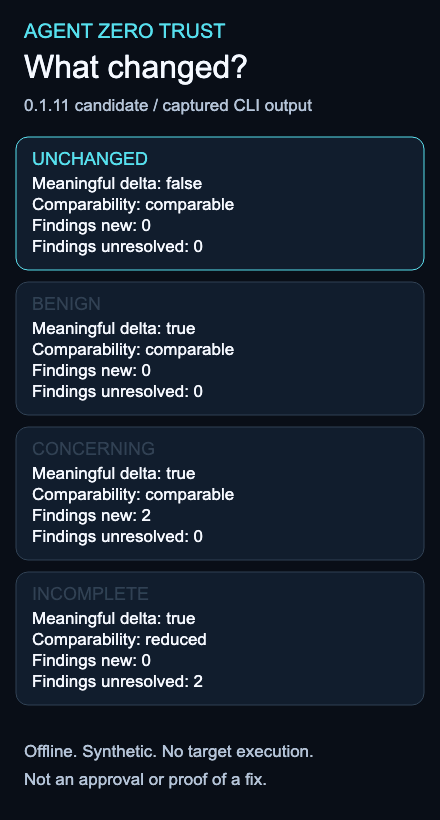

# What changed since I last checked?

Four tiny inert projects demonstrate unchanged input, a benign documentation
edit, a concerning instruction and incomplete inspection. No suspicious command
is executed. The `example.invalid` destination is never contacted.



[Static mobile-friendly image](demo.png) · [Text transcript](transcript.txt).
Animation highlights actual captured output with editorial pacing, not measured
command latency. No live agent or target execution is depicted.

## Install and reproduce version 0.1.11

Python 3.9+ on Linux or macOS, Git and a normal Python virtual environment are
required. Installation/build tools may download packages; subsequent AZT
operations are offline. No Docker, account, model, hook or API key is needed.
Earlier packages do not include change review. Check the
[release listing](https://github.com/ralfyishere/agent-zero-trust/releases/tag/v0.1.11)
for tag availability; a GitHub Release can precede the owner-approved PyPI upload.
This source-build path does not require the PyPI upload to have completed.

```sh
git clone --branch v0.1.11 https://github.com/ralfyishere/agent-zero-trust.git
cd agent-zero-trust
python3 -m venv .venv
.venv/bin/python -m pip install build
.venv/bin/python -m build
.venv/bin/python -m pip install --no-index --no-deps dist/agent_zero_trust-0.1.11-py3-none-any.whl
LAB_ROOT=$(mktemp -d)
LAB_ROOT=$(cd "$LAB_ROOT" && pwd -P)
.venv/bin/python scripts/change_review_lab.py --cli "$PWD/.venv/bin/azt" --output "$LAB_ROOT/result"
```

Use a fresh trusted checkout/dist and a new output directory. `pwd -P` avoids
macOS temporary-directory symlink aliases, which the safe reader rejects.
The helper creates `result/fixtures/`, saves scan JSON beside (not inside) those
trees, and runs the real installed commands below. It asserts the frozen
expectations in `fixtures.json` and captures `transcript.txt`, `results.json`,
comparison JSON and self-contained HTML. It is not a new privileged test pack.

## The individual commands

After the helper constructs the fixtures, these are the equivalent operations.
Run without `set -e`: the concerning scan deliberately returns 1; incomplete
returns 2. Those codes are observations to review, not setup success.

```sh
.venv/bin/azt scan "$LAB_ROOT/result/fixtures/baseline" --json > "$LAB_ROOT/before.json"
.venv/bin/azt scan "$LAB_ROOT/result/fixtures/concerning" --json > "$LAB_ROOT/after.json"
.venv/bin/azt changes --before "$LAB_ROOT/before.json" --after "$LAB_ROOT/after.json"
.venv/bin/azt explain net.pipe_shell
.venv/bin/azt changes --before "$LAB_ROOT/before.json" --after "$LAB_ROOT/after.json" --json --output "$LAB_ROOT/changes.json"
.venv/bin/azt changes --before "$LAB_ROOT/before.json" --after "$LAB_ROOT/after.json" --format html --output "$LAB_ROOT/review.html"
.venv/bin/azt report --input "$LAB_ROOT/after.json" --format text --output "$LAB_ROOT/scan.txt"
```

Open the HTML locally. No automatic publication or network access occurs. Export
paths must be new files in an operator-owned non-group/world-writable directory.

| Comparison | Expected observation |
| --- | --- |
| Baseline with itself | No meaningful delta, no new finding |
| Baseline → benign | README bytes changed, no new finding |
| Baseline → concerning | AGENTS.md modified, two new findings: net.fetch_unknown and net.pipe_shell |
| Concerning → incomplete | Reduced comparability, two unresolved findings, none credited as fixed |

The last case replaces instructions and supplies malformed supported JSON.
Disappearing detections cannot be credited as resolved under incomplete scope.
The benchmark measures these declared behaviors, not real-world detection rates.

See [contract and limits](../../docs/change-review.md), the [captured transcript](transcript.txt)
and [evidence index](../../evidence/change-review/README.md). The [static demo](demo.svg)
is a short selection of actual output; the text transcript is mobile-friendly.

## Re-evaluate the frozen cases

```sh
.venv/bin/python scripts/evaluate_review.py --python "$PWD/.venv/bin/python" --output "$LAB_ROOT/evaluation.json"
python3 -m unittest discover -s tests -p test_review.py -v
```

The frozen case list is `evaluation-cases.json`; assertions are in
`tests/test_review.py`. Test-owned malformed reports are data. Do not execute
repository hooks or substitute an online/model test for this offline lab.
